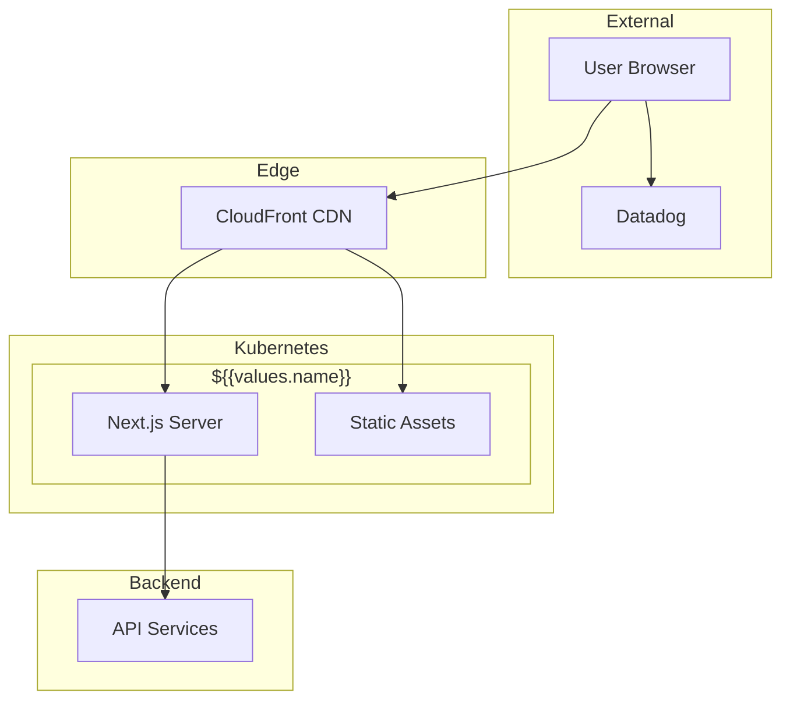
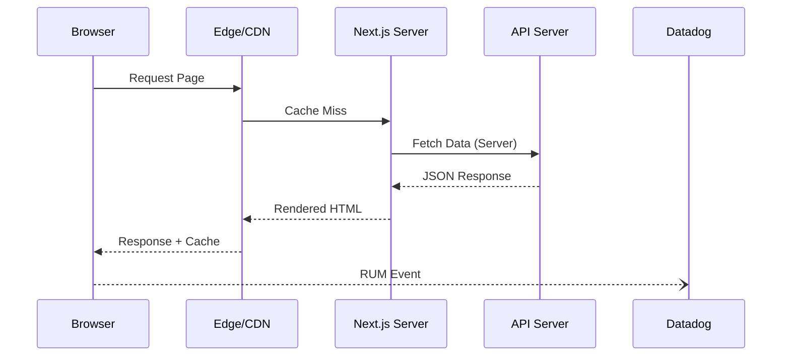
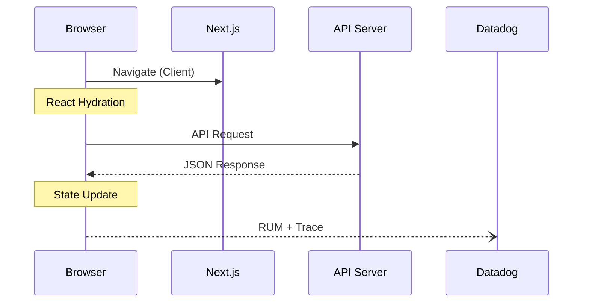
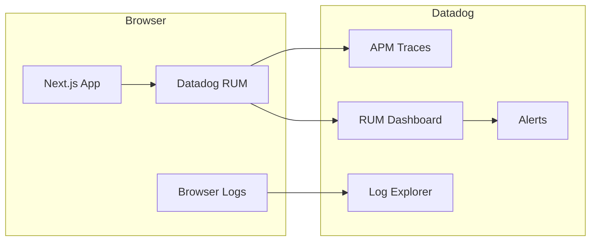

# Architecture Overview

## Application Architecture



## Request Flow (Server Components)



## Request Flow (Client Components)



## Component Architecture

```mermaid
graph TB
    subgraph Pages["App Router"]
        Layout[layout.tsx]
        Page[page.tsx]
        Loading[loading.tsx]
        Error[error.tsx]
    end

    subgraph Components
        UI[UI Components]
        Feature[Feature Components]
        Forms[Form Components]
    end

    subgraph State
        
        Store[Zustand Store]
        
        Atoms[Jotai Atoms]
        
        Redux[Redux Store]
        
        Context[React Context]
        
    end

    subgraph Data
        
        Query[TanStack Query]
        
        SWR[SWR]
        
        Fetch[Server Actions]
        
        API[API Client]
    end

    Layout --> Page
    Page --> Feature
    Feature --> UI
    
    Forms --> UI
    
    Feature --> State
    Feature --> Data
    Data --> API
```

## Provider Stack

```mermaid
flowchart TB
    subgraph Providers
        Root[RootLayout]
        Theme[ThemeProvider]
        
        Query[QueryClientProvider]
        
        
        Redux[ReduxProvider]
        
        
        Auth[AuthProvider]
        
        App[Application]
    end

    Root --> Theme
    
    Theme --> Query
    Query --> App
    
    Theme --> App
    
```

## Data Flow

```mermaid
flowchart LR
    subgraph Client
        UI[UI Component]
        Hook[Custom Hook]
        
        Cache[Query Cache]
        
    end

    subgraph Server
        Action[Server Action]
        Route[API Route]
    end

    subgraph External
        API[Backend API]
    end

    UI --> Hook
    
    Hook --> Cache
    Cache --> Route
    
    Hook --> Route
    
    Route --> API
    Action --> API
```

## Build & Deploy

```mermaid
flowchart TB
    subgraph GitHub
        Repo[Repository]
        Actions[GitHub Actions]
    end

    subgraph Build
        Lint[ESLint + TypeScript]
        Test[Unit + E2E Tests]
        Build[Next.js Build]
    end

    subgraph Registry
        ECR[Container Registry]
    end

    subgraph Kubernetes
        Deploy[Deployment]
        SVC[Service]
        HPA[HPA]
        Ingress[Ingress]
    end

    subgraph CDN
        CF[CloudFront]
        S3[S3 Static]
    end

    Repo --> Actions
    Actions --> Lint
    Lint --> Test
    Test --> Build
    Build --> ECR
    Build --> S3
    ECR --> Deploy
    Deploy --> SVC
    SVC --> Ingress
    Ingress --> CF
    S3 --> CF
```

## Directory Structure

```
src/
├── app/                    # Next.js App Router
│   ├── layout.tsx          # Root layout
│   ├── page.tsx            # Home page
│   ├── error.tsx           # Error boundary
│   ├── not-found.tsx       # 404 page
│   ├── loading.tsx         # Loading UI
│   └── api/                # API routes
│       └── health/         # Health endpoint
├── components/             # React components
│   ├── ui/                 # UI primitives (shadcn)
│   └── [feature]/          # Feature components
├── hooks/                  # Custom React hooks
│   └── use-[name].ts
├── lib/                    # Utilities
│   ├── api.ts              # API client
│   ├── datadog.tsx         # Datadog RUM
│   └── utils.ts            # Helpers
├── providers/              # Context providers
│   └── index.tsx           # Combined providers
├── stores/                 # State management
│   └── [name].ts
└── types/                  # TypeScript types
    └── index.ts
```

## Security Model

```mermaid
flowchart TB
    subgraph Browser
        User[User]
        RUM[Datadog RUM]
    end

    subgraph Edge
        WAF[WAF]
        CDN[CloudFront]
    end

    subgraph Next.js
        Headers[Security Headers]
        CSP[Content Security Policy]
        
        Auth[Auth Middleware]
        
        App[Application]
    end

    User --> WAF
    WAF --> CDN
    CDN --> Headers
    Headers --> CSP
    
    CSP --> Auth
    Auth --> App
    
    CSP --> App
    
```

## Observability


